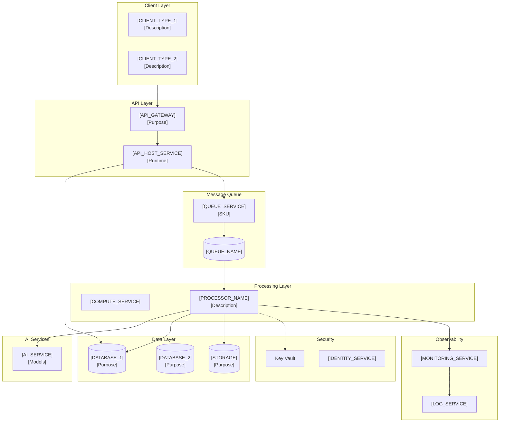
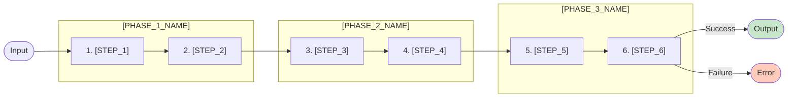
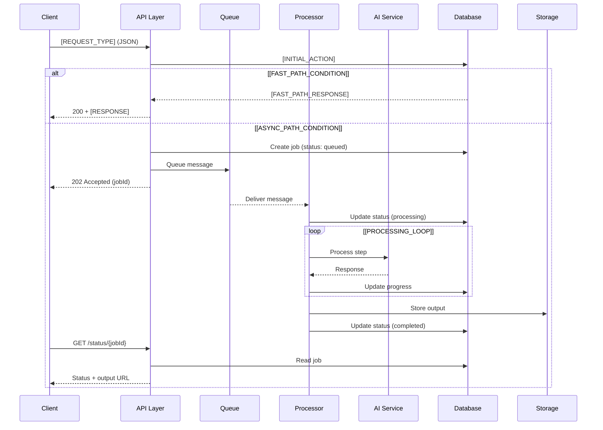
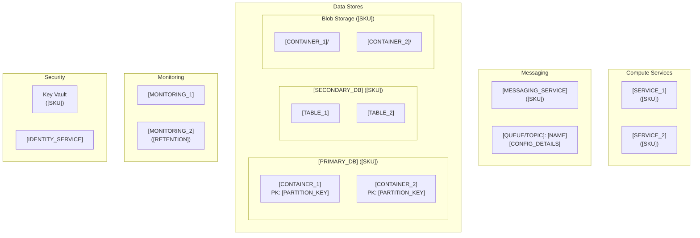
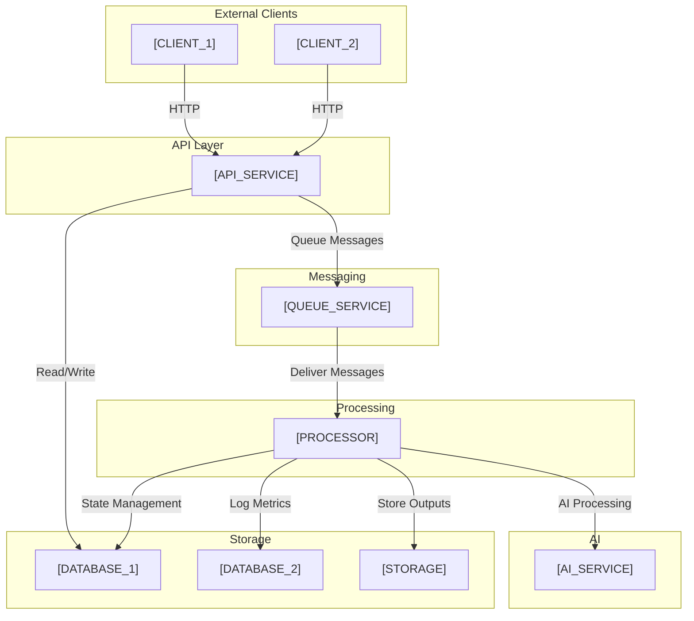
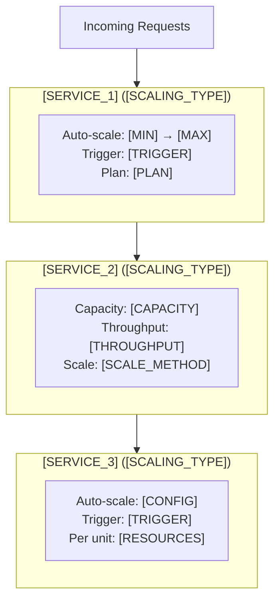
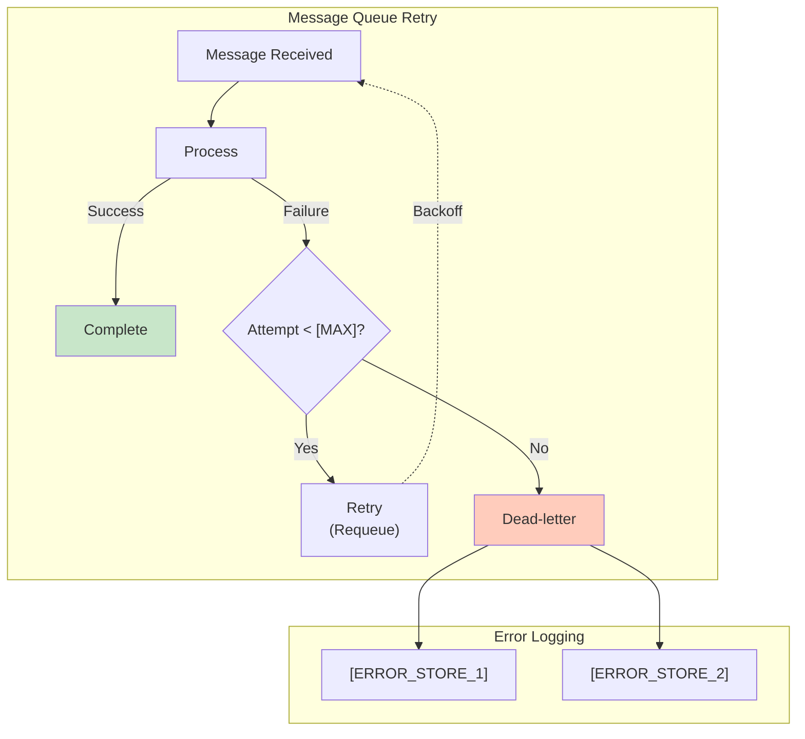

# [PROJECT_NAME] - Architecture

## Instructions for Claude Code

This template documents the complete architecture of the solution. Populate each section by analyzing:
- The approved scope of work (`deliverables/SCOPE_OF_WORK.md`)
- Discovery artifacts in `artifacts/`
- Infrastructure code in `concept/infra/`
- Application code in `concept/apps/`
- The `concept/AZURE_CONFIG.json` for deployed resources

Replace all `[PLACEHOLDER]` values with actual information. Remove sections that are not applicable. All Mermaid diagrams should accurately reflect the implemented architecture.

**Key Principles:**
- Diagrams should be accurate and reflect actual implementation
- Include all Azure services and their relationships
- Document data flows clearly
- Capture scaling and error handling strategies

---

## Table of Contents

1. [High-Level Architecture](#1-high-level-architecture)
2. [Workflow Pipeline](#2-workflow-pipeline)
3. [Request Lifecycle](#3-request-lifecycle)
4. [Azure Services Infrastructure](#4-azure-services-infrastructure)
5. [Data Storage Architecture](#5-data-storage-architecture)
6. [Service Dependencies](#6-service-dependencies)
7. [Scaling & Autoscaling](#7-scaling--autoscaling)
8. [Error Handling & Retry Logic](#8-error-handling--retry-logic)

---

## 1. High-Level Architecture

[Provide a brief description of the overall architecture approach, key design decisions, and rationale.]



### Architecture Decisions

| Decision | Choice | Rationale |
|----------|--------|-----------|
| [DECISION_1] | [CHOICE] | [RATIONALE] |
| [DECISION_2] | [CHOICE] | [RATIONALE] |
| [DECISION_3] | [CHOICE] | [RATIONALE] |

---

## 2. Workflow Pipeline

[Describe the main processing workflow. If using an orchestration framework (LangGraph, Durable Functions, Logic Apps, etc.), document the node/step structure.]



### Step Details

| Step | Purpose | Technology | Key Outputs |
|------|---------|------------|-------------|
| 1. [STEP_1] | [PURPOSE] | [TECH] | [OUTPUTS] |
| 2. [STEP_2] | [PURPOSE] | [TECH] | [OUTPUTS] |
| 3. [STEP_3] | [PURPOSE] | [TECH] | [OUTPUTS] |
| 4. [STEP_4] | [PURPOSE] | [TECH] | [OUTPUTS] |
| 5. [STEP_5] | [PURPOSE] | [TECH] | [OUTPUTS] |
| 6. [STEP_6] | [PURPOSE] | [TECH] | [OUTPUTS] |

---

## 3. Request Lifecycle

[Document the complete lifecycle of a request from client submission to final response.]



---

## 4. Azure Services Infrastructure

[Document all Azure services, their SKUs, and configurations.]



### Resource Summary

| Resource Type | Resource Name | SKU/Tier | Configuration |
|---------------|---------------|----------|---------------|
| [TYPE] | [NAME] | [SKU] | [CONFIG] |
| [TYPE] | [NAME] | [SKU] | [CONFIG] |
| [TYPE] | [NAME] | [SKU] | [CONFIG] |

---

## 5. Data Storage Architecture

### [PRIMARY_DATABASE] Collections/Tables

```mermaid
erDiagram
    [ENTITY_1] {
        [TYPE] [FIELD_1] PK
        [TYPE] [FIELD_2]
        [TYPE] [FIELD_3]
        [TYPE] [FIELD_4]
        datetime [TIMESTAMP_FIELD]
    }

    [ENTITY_2] {
        [TYPE] [FIELD_1] PK
        [TYPE] [FIELD_2]
        [TYPE] [FIELD_3]
        datetime [TIMESTAMP_FIELD]
    }

    [ENTITY_1] ||--o{ [ENTITY_2] : has
```

### [SECONDARY_DATABASE] Schema

```mermaid
erDiagram
    [TABLE_1] ||--o{ [TABLE_2] : has
    [TABLE_1] ||--o{ [TABLE_3] : has

    [TABLE_1] {
        [TYPE] [FIELD_1] PK
        [TYPE] [FIELD_2]
        [TYPE] [FIELD_3]
    }

    [TABLE_2] {
        [TYPE] [FIELD_1] PK
        [TYPE] [FIELD_2] FK
        [TYPE] [FIELD_3]
    }
```

### Blob Storage Structure

```
[CONTAINER_1]/
├── [FOLDER_1]/
│   ├── [FILE_TYPE]
│   └── [FILE_TYPE]
├── [FOLDER_2]/
│   └── ...
└── [FOLDER_3]/
    └── ...

[CONTAINER_2]/
├── {[ID_PATTERN]}/
│   ├── [OUTPUT_FILE]
│   ├── [METADATA_FILE]
│   └── [SUBFOLDER]/
│       └── [GENERATED_FILES]
└── ...
```

---

## 6. Service Dependencies



### Dependency Matrix

| Service | Depends On | Depended By |
|---------|------------|-------------|
| [SERVICE_1] | [DEPENDENCIES] | [DEPENDENTS] |
| [SERVICE_2] | [DEPENDENCIES] | [DEPENDENTS] |
| [SERVICE_3] | [DEPENDENCIES] | [DEPENDENTS] |
| [SERVICE_4] | [DEPENDENCIES] | [DEPENDENTS] |

---

## 7. Scaling & Autoscaling



### Scaling Configuration

| Component | Min | Max | Trigger | Scale Time |
|-----------|-----|-----|---------|------------|
| [COMPONENT_1] | [MIN] | [MAX] | [TRIGGER] | [TIME] |
| [COMPONENT_2] | [MIN] | [MAX] | [TRIGGER] | [TIME] |
| [COMPONENT_3] | [MIN] | [MAX] | [TRIGGER] | [TIME] |

---

## 8. Error Handling & Retry Logic



### Error Codes

| Code | Description | Retryable | Max Retries |
|------|-------------|-----------|-------------|
| `[ERROR_CODE_1]` | [DESCRIPTION] | [YES/NO] | [COUNT] |
| `[ERROR_CODE_2]` | [DESCRIPTION] | [YES/NO] | [COUNT] |
| `[ERROR_CODE_3]` | [DESCRIPTION] | [YES/NO] | [COUNT] |
| `[ERROR_CODE_4]` | [DESCRIPTION] | [YES/NO] | [COUNT] |

---

## Technology Stack Summary

| Layer | Technology | Version |
|-------|------------|---------|
| **API** | [TECHNOLOGY] | [VERSION] |
| **Processing** | [TECHNOLOGY] | [VERSION] |
| **AI** | [TECHNOLOGY] | [MODELS] |
| **Messaging** | [TECHNOLOGY] | [SKU] |
| **Primary Database** | [TECHNOLOGY] | [SKU] |
| **Secondary Database** | [TECHNOLOGY] | [SKU] |
| **Storage** | [TECHNOLOGY] | [SKU] |
| **Monitoring** | [TECHNOLOGY] | [TYPE] |
| **IaC** | [TECHNOLOGY] | [VERSION] |

---

*Last updated: [DATE]*
